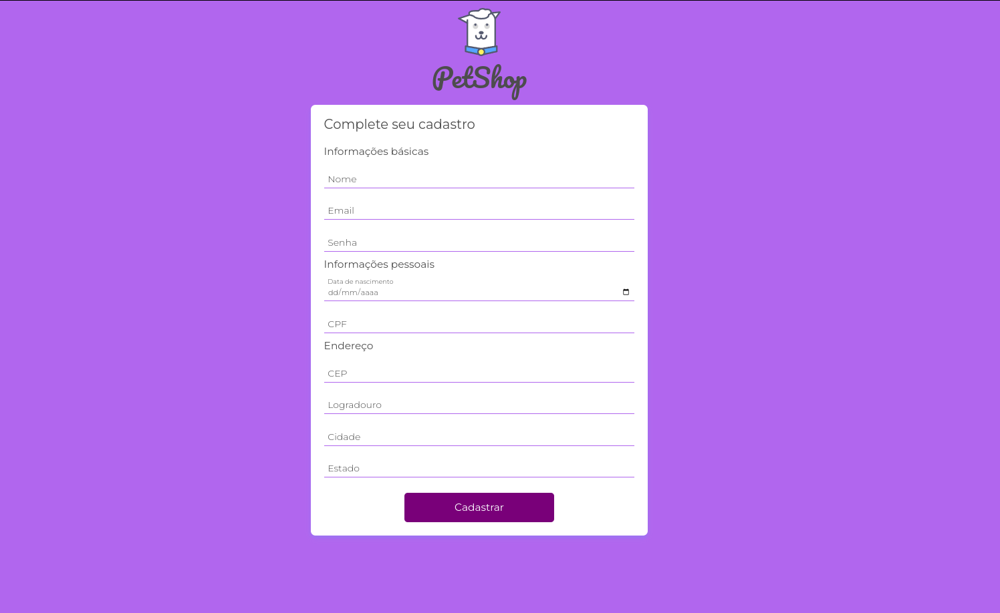
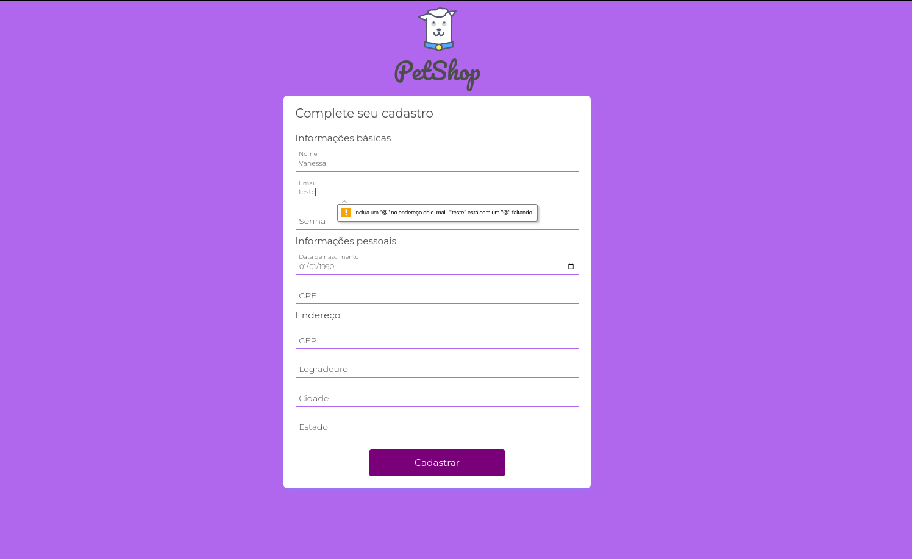
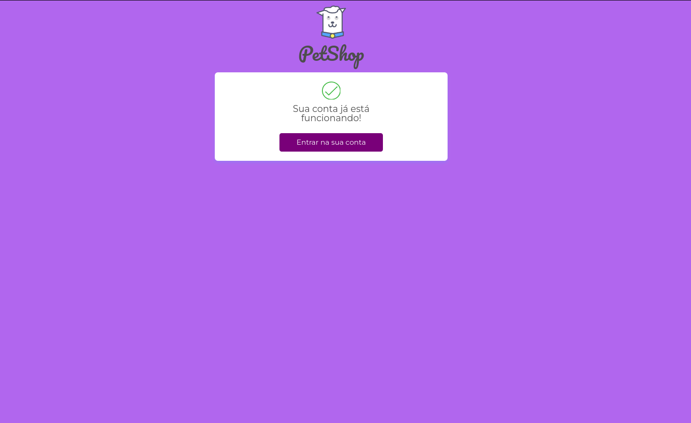

# Validação de Formulários e HTML5

Este projeto consiste em uma aplicação web desenvolvida utilizando JavaScript, HTML e CSS para realizar a validação de formulários utilizando recursos do HTML5.

### Objetivo
O objetivo deste projeto é fornecer uma solução eficiente e fácil de usar para a validação de formulários web. Com a implementação do HTML5, podemos utilizar recursos nativos do navegador para validar os campos de entrada e fornecer feedback instantâneo aos usuários.

### Recursos
A aplicação utiliza os seguintes recursos:

+ JavaScript: A lógica de validação é implementada em JavaScript, permitindo o processamento dinâmico dos campos do formulário e a exibição de mensagens de erro.
+ HTML5: O HTML5 introduz novos atributos e tipos de entrada que facilitam a validação de formulários. Esses recursos são utilizados para garantir a integridade dos dados fornecidos pelos usuários.
+ CSS: O CSS é aplicado para melhorar a aparência dos elementos de formulário e fornecer uma experiência visual agradável durante a validação.
Funcionalidades
O projeto de validação de formulários e HTML5 inclui as seguintes funcionalidades:

## Validação de campos obrigatórios: 
Os campos obrigatórios são verificados para garantir que não sejam deixados em branco.
Validação de tipos de entrada: Os tipos de entrada, como e-mail, cpf, são validados de acordo com as restrições específicas do tipo de campo. 
## Mensagens de erro:  
Caso ocorra algum erro de validação, mensagens de erro são exibidas para orientar o usuário sobre o problema e como corrigi-lo. 
Feedback visual: Além das mensagens de erro, o projeto utiliza recursos visuais para destacar os campos inválidos, fornecendo uma indicação clara aos usuários.
## Como utilizar: 
Para utilizar o projeto de validação de formulários e HTML5, basta seguir as etapas abaixo:

Faça o download ou clone o repositório para o seu ambiente de desenvolvimento.
Abra o arquivo HTML no seu navegador preferido.
Preencha os campos do formulário e observe a validação em tempo real.
Caso ocorra algum erro de validação, verifique as mensagens de erro exibidas e corrija os campos correspondentes.
Envie o formulário com sucesso quando todos os campos estiverem corretamente preenchidos.
Conclusão
O projeto de Validação de Formulários e HTML5 oferece uma solução simples e eficaz para a validação de formulários web, aproveitando os recursos do HTML5 e fornecendo feedback imediato aos usuários.

Contribuições são bem-vindas! Se você encontrar algum problema ou tiver sugestões de melhoria, não hesite em abrir uma issue ou enviar um pull request.

Divirta-se validando seus formulários com o projeto Validação de Formulários e HTML5!

 
 
 
